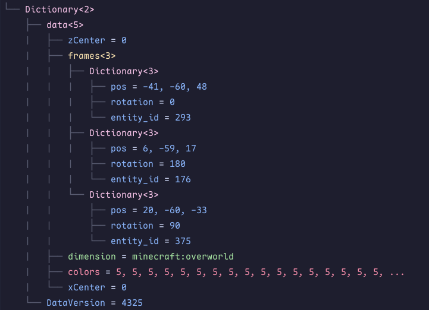
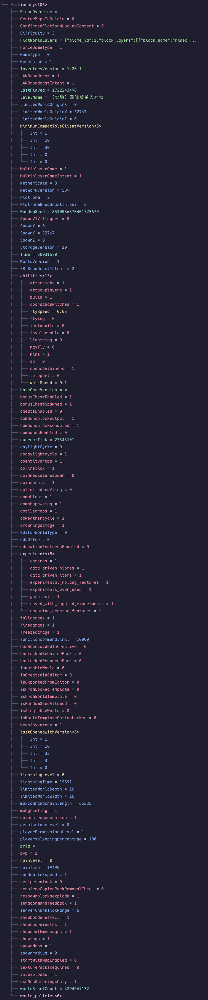
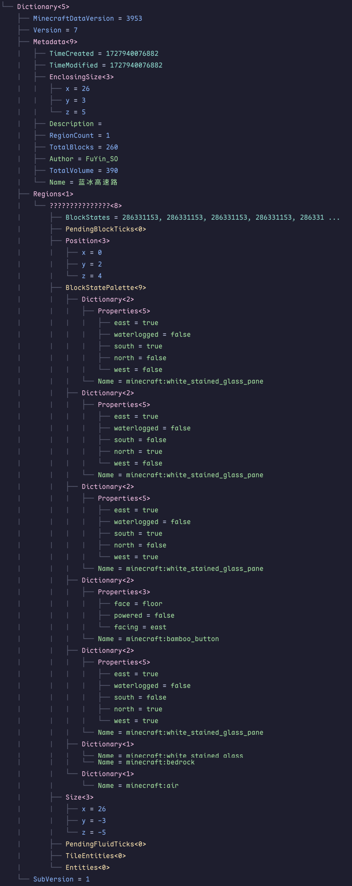

# Introduction

This is a tool that helps loading & construct tree-structured Minecraft NBT files in C# projects.

# Process

- ✅ Serialize
- ✅ Construct Tree-structured
- ⬜ Change
- ⬜ Delete
- ⬜ Add
- ⬜ Deserialize

# Using

## Print tree-structured

1. Load NBT file as a **byte Array**

```Cs
public static byte[] ReadBytes(string path)
    {
        var fileStream = new FileStream(path, FileMode.Open, FileAccess.Read);
        var binaryReader = new BinaryReader(fileStream);
        if (fileStream.Length > int.MaxValue) throw new Exception("Not Supported for length above Int32!");
        return binaryReader.ReadBytes((int)fileStream.Length);
    }
```

2. New a **NbtParser** then use **Parse()**

```Cs
using NBT_Parser
// Tip: In bedrock Edition, "isBigEndian" should be false, and begins at 8
var treeTag = new NbtParser().Parse(bytes, true, 0);

// You can use this function to ensure Java or Bedrock edition
// In bedrock Edition, NBT file start with 2 intgers, the second one is length of NBT file.
// See more at Minecraft Wiki 
private static (int begin, bool isBigEndian) GetNbtBytesInfo(byte[] bytes)
    {
        var sizeField = bytes.AsSpan(4, 4);
        var sizeLittleEndian = BinaryPrimitives.ReadInt32LittleEndian(sizeField);
        if (sizeLittleEndian + 8 == bytes.Length) return (8, false);
        return (0, true);
    }
```

3. Print tree-structured

```Cs
treeTag.PrintTree();
```

# Get NBT tag data

The **NbtTag** object have 3 public attribute:
```Cs
public readonly NbtTagEnum Tag;
public readonly List<NbtTag> Children;
public readonly NbtTagEnum ChildrenTag;
```
and 2 public functions:
```Cs
public string GetValue()
public string GetName()
```

So you can easily get data like this:
```csharp
nbtTag.Children[0].GetName();
nbtTag.Children[0].GetValue();
```

# Examples

1. map.nbt (Java)
   
2. level.dat (Bedrock)
   
3. litematica
   
